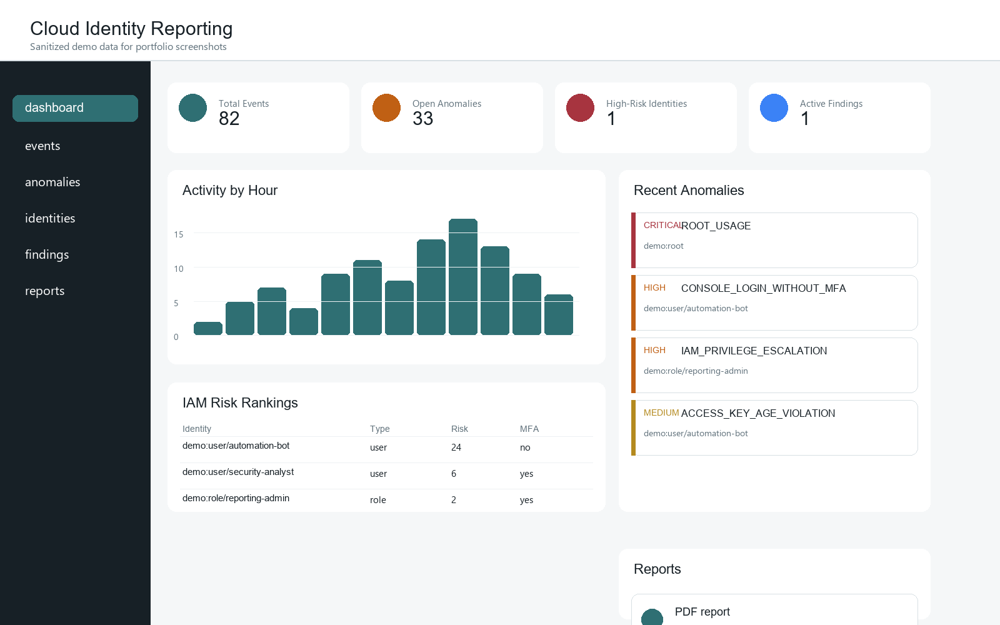
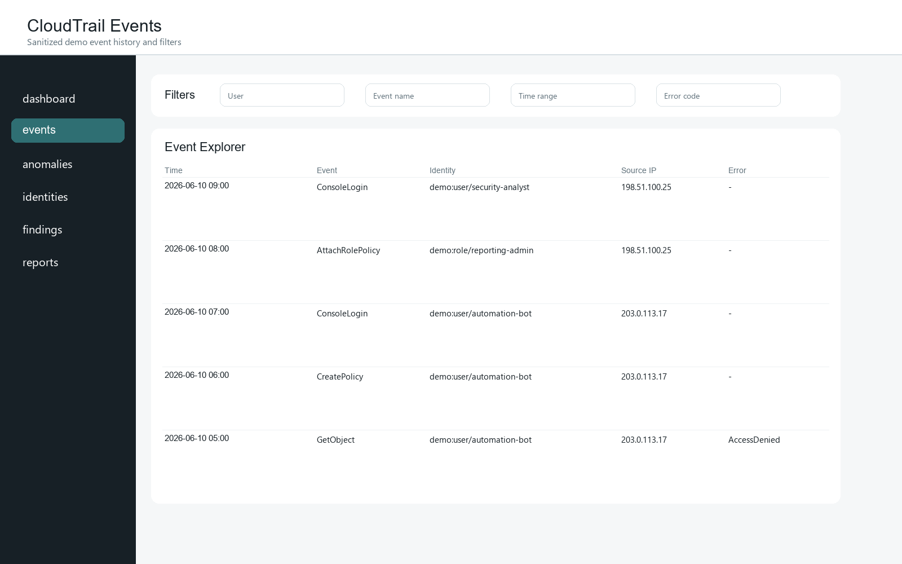
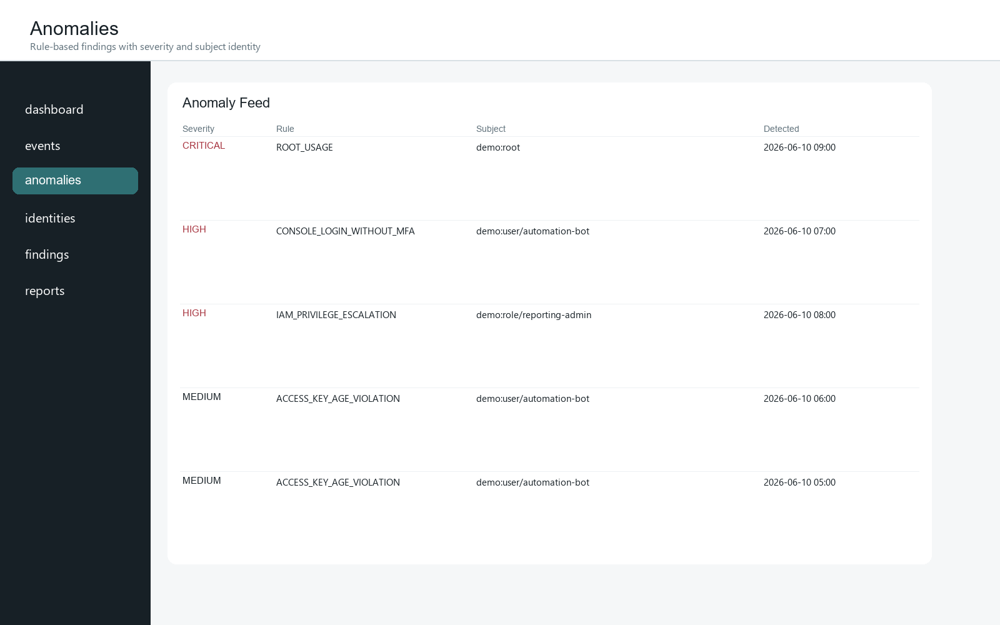
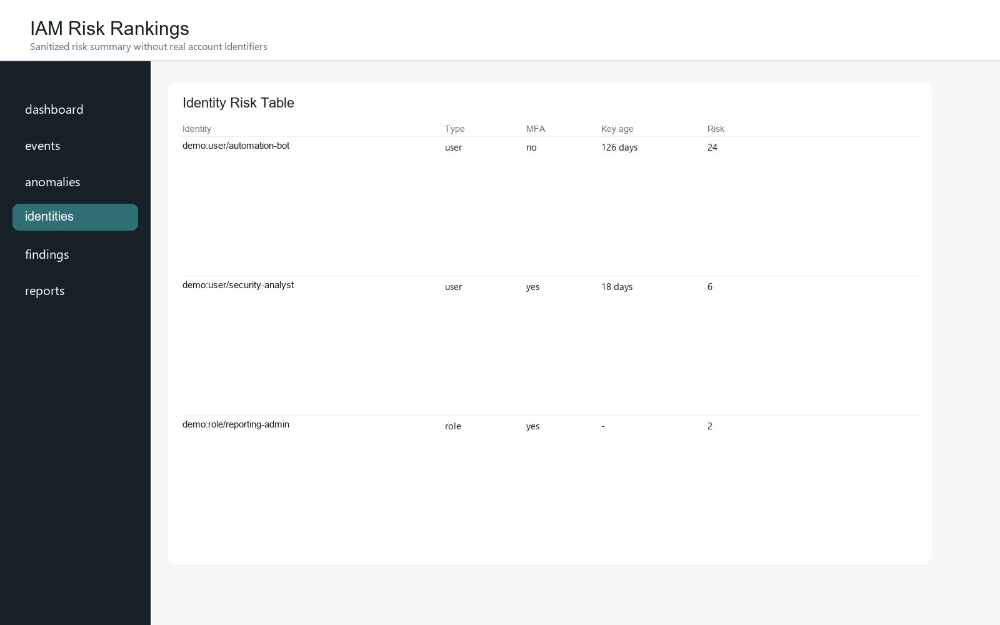
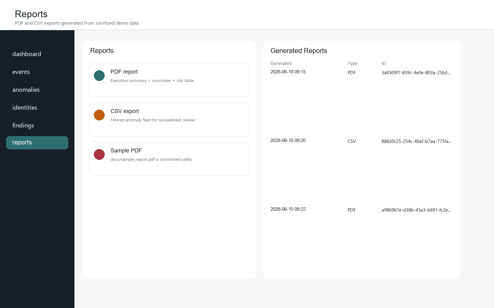
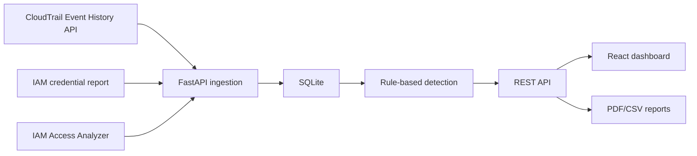

# Data Protection Reporting Platform

A full-stack cloud identity monitoring and reporting platform for AWS environments.

The app ingests AWS CloudTrail Event History, IAM credential reports, and IAM Access Analyzer external findings through AWS APIs, stores results in SQLite, detects identity-risk anomalies, calculates risk scores, and presents findings through a React dashboard with PDF/CSV reports.

> Screenshots and the sample report in this repository use sanitized demo data only. They do not include real AWS account IDs, IAM ARNs, source IPs, access keys, or deployment state.

## Screenshots

| Dashboard | Events |
|---|---|
|  |  |

| Anomalies | Identity Risk |
|---|---|
|  |  |

| Reports |
|---|
|  |

Sample PDF report: [docs/sample_report.pdf](docs/sample_report.pdf)

## Architecture

See [docs/architecture.md](docs/architecture.md).



## Detection Rules

- Root account usage
- Console login without MFA
- IAM privilege escalation activity
- AccessDenied spike
- Sensitive API at unusual hour
- Access key age violation
- Missing MFA on IAM user
- Public resource exposure from Access Analyzer

## Local Development

```powershell
python -m venv .venv
.\.venv\Scripts\python -m pip install -r backend\requirements.txt
cd frontend
npm install
npm run build
cd ..
$env:PYTHONPATH="backend"
.\.venv\Scripts\python -m pytest backend\tests
```

Run with sanitized demo data:

```powershell
$env:DATABASE_PATH="backend\data\demo.sqlite3"
$env:REPORT_DIR="backend\reports\out"
$env:AWS_REGION="ap-south-1"
.\.venv\Scripts\python backend\scripts\seed_demo_data.py
.\.venv\Scripts\python -m uvicorn app.main:app --app-dir backend --host 127.0.0.1 --port 8000
```

In another terminal:

```powershell
cd frontend
$env:VITE_API_BASE_URL="http://127.0.0.1:8000"
npm run dev
```

## AWS Free-Tier Deployment

This project is designed for a short-lived AWS Free Tier demo:

- No S3 trail bucket, CloudTrail Lake, CloudWatch log delivery, load balancer, NAT Gateway, or Elastic IP.
- CloudTrail is queried only through Event History `lookup_events`.
- Access Analyzer usage is restricted to external/account analyzers.
- AWS Budget notifications are created before EC2 provisioning.
- Deployment creates one small EC2 instance and includes teardown automation.

Public IPv4 can still create billing risk. Prefer IPv6 where available and always run teardown after the demo.

```powershell
$env:BILLING_ALERT_EMAIL="you@example.com"
.\scripts\aws-preflight.ps1
.\scripts\deploy-ec2.ps1
```

Teardown:

```powershell
.\scripts\teardown-aws.ps1
```

## Main APIs

- `GET /health`
- `POST /ingest`
- `GET /events`
- `GET /events/summary`
- `GET /anomalies`
- `GET /anomalies/summary`
- `GET /identities/risk`
- `GET /findings`
- `GET /credentials`
- `POST /reports/generate`
- `GET /reports/download/{id}`
