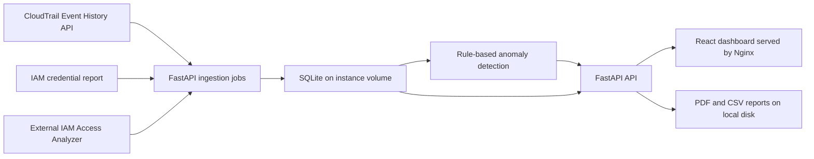

# Architecture

The deployed app runs on one short-lived EC2 instance. The React build is served by Nginx, and `/api/*` requests proxy to FastAPI on `127.0.0.1:8000`.

No project S3 bucket, CloudTrail trail, CloudTrail Lake, load balancer, NAT Gateway, Elastic IP, or CloudWatch log delivery is created.

